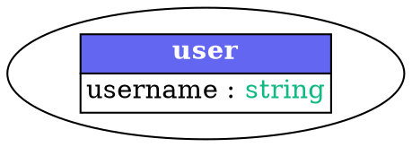
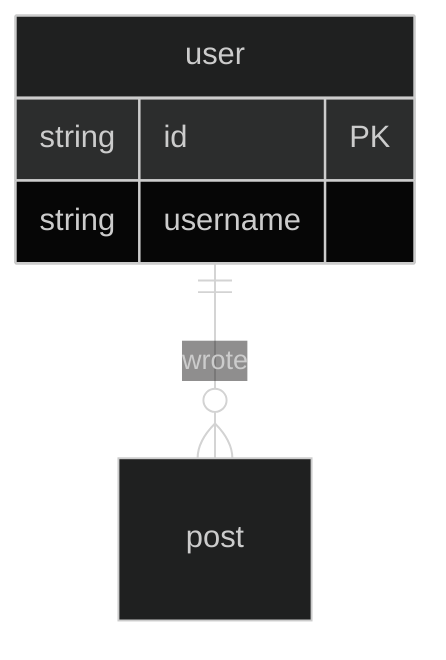

# Visualization Rendering Guide

This guide explains how to **render** Reverie's schema visualizations to see the beautiful styled output with colors, gradients, and themeing.

## Important: Source Code vs Rendered Output

When you generate visualizations with Reverie, you get **source code** that needs to be **rendered** to display visually:

- **GraphViz**: You see DOT code with HTML-like tags for colors → needs GraphViz to render
- **Mermaid**: You see markdown with theme directives → needs Mermaid.js to render
- **ASCII**: You see text with ANSI escape codes → needs a color-supporting terminal to render

**The styling IS present in the code** (colors, gradients, Unicode characters), but you need the right tools to see it rendered beautifully.

---

## Table of Contents

- [GraphViz Rendering](#graphviz-rendering)
- [Mermaid Rendering](#mermaid-rendering)
- [ASCII Rendering](#ascii-rendering)
- [Quick Commands Summary](#quick-commands-summary)
- [Recommended Tools](#recommended-tools)
- [Troubleshooting](#troubleshooting)

---

## GraphViz Rendering

### What You See (Source Code)



This is DOT language with:
- HTML table formatting
- `BGCOLOR` and `FONT COLOR` for styling
- Semantic colors for field types

### What You Need to See (Rendered)

A professional diagram with:
- ✨ Colored table headers
- 🎨 Gradient backgrounds
- 🔤 Syntax-highlighted field types
- 📊 Relationships with arrows

### How to Render

#### Option 1: Command Line (Recommended)

Install GraphViz:
```bash
# macOS
brew install graphviz

# Ubuntu/Debian
sudo apt-get install graphviz

# Windows (using Chocolatey)
choco install graphviz

# Windows (using Scoop)
scoop install graphviz
```

Render to image:
```bash
# PNG format
dot -Tpng schema.dot -o schema.png

# SVG format (scalable, recommended for docs)
dot -Tsvg schema.dot -o schema.svg

# PDF format
dot -Tpdf schema.dot -o schema.pdf
```

#### Option 2: Online Viewers

**Graphviz Online** (Quick Preview):
1. Go to [https://dreampuf.github.io/GraphvizOnline/](https://dreampuf.github.io/GraphvizOnline/)
2. Paste your DOT code
3. See rendered diagram instantly

**Edotor** (Feature-Rich):
1. Go to [https://edotor.net/](https://edotor.net/)
2. Paste your DOT code
3. Export as PNG/SVG

#### Option 3: VS Code Extension

Install "Graphviz Preview" extension:
1. Open VS Code
2. Install `joaompinto.vscode-graphviz` extension
3. Open `.dot` file
4. Press `Ctrl+Shift+V` (or `Cmd+Shift+V` on Mac) to preview

### Example Workflow

```bash
# Generate visualization
python docs/examples/visualization_example.py > output.txt

# Extract DOT code to file (or copy/paste)
# Save the GraphViz section to schema.dot

# Render to PNG
dot -Tpng schema.dot -o schema.png

# Open the image
open schema.png  # macOS
start schema.png # Windows
xdg-open schema.png # Linux
```

---

## Mermaid Rendering

### What You See (Source Code)



This is Mermaid markdown with:
- Theme directives (`%%{init: {'theme':'dark'}}%%`)
- Entity-relationship syntax
- Relationship cardinality symbols

### What You Need to See (Rendered)

A beautiful ER diagram with:
- 🌙 Dark theme styling
- 📦 Entity boxes with fields
- ↔️ Relationship lines with labels
- 🎨 Color-coded constraints

### How to Render

#### Option 1: GitHub/GitLab (Easiest)

GitHub and GitLab automatically render Mermaid in markdown:

1. Save to a `.md` file:
   ```markdown
   # My Schema
   
   ```mermaid
   erDiagram
       user {
           string id PK
       }
   ```
   ```

2. Push to GitHub/GitLab
3. View the file - diagram renders automatically!

#### Option 2: Mermaid Live Editor (Quick Preview)

1. Go to [https://mermaid.live/](https://mermaid.live/)
2. Paste your Mermaid code (without the triple backticks)
3. See rendered diagram
4. Export as SVG/PNG

#### Option 3: VS Code Extensions

**Markdown Preview Mermaid Support**:
1. Install `bierner.markdown-mermaid` extension
2. Open `.md` file with Mermaid code
3. Press `Ctrl+Shift+V` to preview
4. Diagram renders in preview pane

**Mermaid Editor**:
1. Install `tomoyukim.vscode-mermaid-editor` extension
2. Open Command Palette (`Ctrl+Shift+P`)
3. Run "Mermaid: Preview Diagram"

#### Option 4: Documentation Sites

Most documentation generators support Mermaid:
- **MkDocs**: Use `mkdocs-mermaid2-plugin`
- **Sphinx**: Use `sphinxcontrib-mermaid`
- **Docusaurus**: Built-in support
- **VuePress**: Built-in support

### Example Workflow

```python
# Generate and save Mermaid diagram
from reverie.schema.visualize import visualize_schema, OutputFormat

diagram = visualize_schema(
    tables=tables,
    edges=edges,
    output_format=OutputFormat.MERMAID,
    theme='dark'
)

# Save to markdown file
with open('schema.md', 'w') as f:
    f.write('# Database Schema\n\n')
    f.write('```mermaid\n')
    f.write(diagram)
    f.write('\n```\n')

# Push to GitHub and view!
```

---

## ASCII Rendering

### What You See (Source Code)

```
╭────────────────────────╮
│[1m        comment         [0m│
├────────────────────────┤
│ id : string [91m🔑 (PK)[0m     │
│ text : string          │
╰────────────────────────╯
```

This is ASCII art with:
- Unicode box-drawing characters (`╭╮╯╰├┤`)
- ANSI color codes (`[1m` = bold, `[91m` = bright red, `[0m` = reset)
- Unicode emoji (`🔑` = primary key, `🔗` = foreign key)

### What You Need to See (Rendered)

Beautiful text-based diagrams with:
- 📦 Rounded box borders
- **Bold** table names
- 🔴 Red primary key indicators
- 🔵 Blue foreign key indicators
- 🎨 Colored constraint labels

### How to Render

#### Option 1: Terminal/Console (Recommended)

Most modern terminals support ANSI colors and Unicode:

**Windows**:
- Windows Terminal (recommended) - full support
- PowerShell 7+ - supports colors and Unicode
- CMD - limited color support

**macOS**:
- Terminal.app - full support
- iTerm2 - full support with better color rendering

**Linux**:
- GNOME Terminal - full support
- Konsole - full support
- xterm - basic support

Run the example:
```bash
# Direct output to terminal
python docs/examples/visualization_example.py

# Or save and view
python docs/examples/visualization_example.py > output.txt
cat output.txt  # Colors display if terminal supports them
```

#### Option 2: Less/More with Color Support

View files with color preservation:
```bash
# Using less with raw output
less -R output.txt

# Using bat (better colors)
bat output.txt
```

Install `bat`:
```bash
# macOS
brew install bat

# Ubuntu/Debian
sudo apt install bat

# Windows (Scoop)
scoop install bat
```

#### Option 3: VS Code Terminal

1. Open VS Code integrated terminal
2. Run your visualization script
3. ANSI colors render automatically

#### Option 4: Convert to HTML

For sharing or web display, convert ANSI to HTML:

```bash
# Using aha (ANSI HTML Adapter)
python docs/examples/visualization_example.py | aha > schema.html

# Install aha
# macOS: brew install aha
# Ubuntu: sudo apt install aha
```

### Plain ASCII (No Colors/Unicode)

If your terminal doesn't support colors or Unicode:

```python
from reverie.schema.visualize import visualize_schema, OutputFormat
from reverie.schema.themes import ASCIITheme

diagram = visualize_schema(
    tables=tables,
    edges=edges,
    output_format=OutputFormat.ASCII,
    theme=ASCIITheme(
        use_unicode=False,
        use_colors=False,
        use_icons=False
    )
)
print(diagram)
```

This produces basic ASCII with `+`, `-`, `|` characters instead of Unicode boxes.

---

## Quick Commands Summary

### GraphViz
```bash
# Generate and render to PNG
dot -Tpng schema.dot -o schema.png

# Generate and render to SVG
dot -Tsvg schema.dot -o schema.svg
```

### Mermaid
```bash
# Save to markdown and view on GitHub
echo '```mermaid' > schema.md
cat mermaid_output.txt >> schema.md
echo '```' >> schema.md

# Or use Mermaid CLI (if installed)
mmdc -i schema.mmd -o schema.png
```

### ASCII
```bash
# View with colors
python visualization_example.py | less -R

# Save and view with bat
python visualization_example.py > schema.txt
bat schema.txt
```

---

## Recommended Tools

### Essential
- **GraphViz**: `dot` command-line tool ([graphviz.org](https://graphviz.org/download/))
- **Modern Terminal**: Windows Terminal, iTerm2, or GNOME Terminal
- **VS Code**: With Graphviz Preview and Markdown Mermaid extensions

### Optional (Enhanced Experience)
- **bat**: Better syntax highlighting for terminal ([github.com/sharkdp/bat](https://github.com/sharkdp/bat))
- **Mermaid CLI**: `npm install -g @mermaid-js/mermaid-cli`
- **aha**: ANSI to HTML converter

### Online Tools (No Installation)
- **GraphViz Online**: [dreampuf.github.io/GraphvizOnline](https://dreampuf.github.io/GraphvizOnline/)
- **Mermaid Live**: [mermaid.live](https://mermaid.live/)
- **Edotor**: [edotor.net](https://edotor.net/)

---

## Troubleshooting

### GraphViz: Colors Not Showing

**Problem**: Rendered image is black and white

**Solutions**:
1. Ensure you're using a modern GraphViz version: `dot -V` (should be 2.40+)
2. Check that HTML labels are enabled (they are by default)
3. Try SVG output instead of PNG: `dot -Tsvg schema.dot -o schema.svg`

### Mermaid: Theme Not Applied

**Problem**: Diagram renders but theme is default/wrong

**Solutions**:
1. Ensure theme directive is at the top: `%%{init: {'theme':'dark'}}%%`
2. Some renderers override themes - try Mermaid Live Editor
3. For GitHub, themes may be limited to: `default`, `dark`, `forest`, `neutral`

### ASCII: Boxes Look Broken

**Problem**: Boxes show as `?` or broken characters

**Solutions**:
1. **Enable Unicode support**:
   - Windows: Use Windows Terminal or PowerShell 7+
   - Linux/Mac: Set `LANG=en_US.UTF-8`

2. **If Unicode isn't available**, use plain ASCII:
   ```python
   theme=ASCIITheme(use_unicode=False)
   ```

### ASCII: Colors Not Showing

**Problem**: ANSI codes visible as `[1m`, `[91m`, etc.

**Solutions**:
1. **Use a color-supporting terminal**:
   - Windows: Windows Terminal, not CMD
   - Mac: Terminal.app or iTerm2
   - Linux: Most modern terminals

2. **When viewing files**, use `less -R` or `bat`

3. **If colors aren't available**, disable them:
   ```python
   theme=ASCIITheme(use_colors=False)
   ```

### ASCII: Emojis Show as Boxes

**Problem**: `🔑` and `🔗` show as `□`

**Solutions**:
1. Ensure terminal font supports emoji (e.g., "Segoe UI Emoji" on Windows)
2. Disable icons if needed:
   ```python
   theme=ASCIITheme(use_icons=False)
   ```

### Windows: Character Encoding Issues

**Problem**: Characters display incorrectly

**Solutions**:
1. **PowerShell**: Run `[Console]::OutputEncoding = [System.Text.Encoding]::UTF8`
2. **CMD**: Run `chcp 65001` (sets UTF-8 code page)
3. **In Python**: The example already includes Windows UTF-8 handling

---

## Testing Your Setup

Run this quick test to verify your rendering setup:

```bash
# 1. Test GraphViz
echo 'digraph { A -> B [color=red]; }' | dot -Tpng -o test.png
# Should create test.png with a red arrow

# 2. Test Mermaid (online)
# Visit mermaid.live and paste: graph LR; A-->B;

# 3. Test ASCII colors
python -c "print('\033[91mRed\033[0m \033[94mBlue\033[0m')"
# Should show "Red" in red and "Blue" in blue

# 4. Test Unicode
python -c "print('╭─╮')"
# Should show box-drawing characters, not question marks
```

---

## Complete Example Workflow

Here's a complete workflow from generation to rendering:

```python
# 1. Generate all formats
from reverie.schema.visualize import visualize_schema, OutputFormat

# GraphViz
graphviz_code = visualize_schema(
    tables=tables,
    edges=edges,
    output_format=OutputFormat.GRAPHVIZ,
    theme='modern'
)
with open('schema.dot', 'w') as f:
    f.write(graphviz_code)

# Mermaid
mermaid_code = visualize_schema(
    tables=tables,
    edges=edges,
    output_format=OutputFormat.MERMAID,
    theme='dark'
)
with open('schema.md', 'w') as f:
    f.write('# Schema\n\n```mermaid\n')
    f.write(mermaid_code)
    f.write('\n```\n')

# ASCII
ascii_art = visualize_schema(
    tables=tables,
    edges=edges,
    output_format=OutputFormat.ASCII,
    theme='forest'
)
with open('schema.txt', 'w', encoding='utf-8') as f:
    f.write(ascii_art)
```

```bash
# 2. Render GraphViz
dot -Tsvg schema.dot -o schema.svg
open schema.svg

# 3. View Mermaid on GitHub or Mermaid Live
# Push schema.md to GitHub, or paste into mermaid.live

# 4. View ASCII in terminal
bat schema.txt
# or
less -R schema.txt
```

---

## Summary

Remember:
- ✅ **The styling IS working** - it's in the generated code
- ✅ **You need to RENDER it** - use the right tools
- ✅ **Each format needs different tools** - GraphViz, Mermaid.js, or color terminal
- ✅ **Quick online options exist** - no installation needed to see your diagrams

The themes, colors, gradients, and Unicode are all present in the output. You just need to render them to see the visual beauty! 🎨
