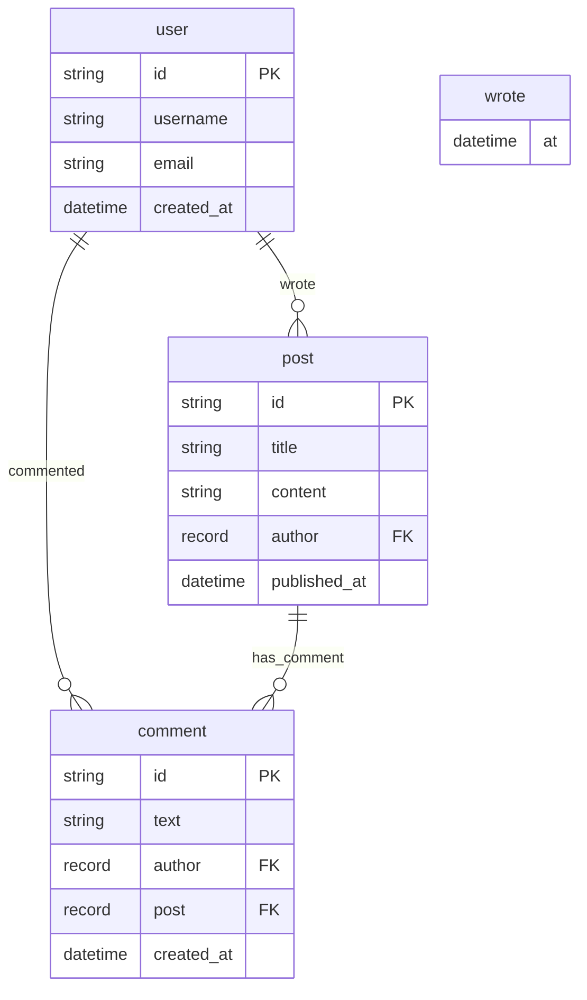

# Blog Schema

```mermaid
%%{init: {'theme':'default'}}%%
erDiagram
    comment {
        string id PK
        string text
        record author FK
        record post FK
        datetime created_at
    }
    post {
        string id PK
        string title
        string content
        record author FK
        datetime published_at
    }
    user {
        string id PK
        string username
        string email
        datetime created_at
    }
    wrote {
        datetime at
    }

    user ||--o{ comment : commented
    post ||--o{ comment : has_comment
    user ||--o{ post : wrote
```
