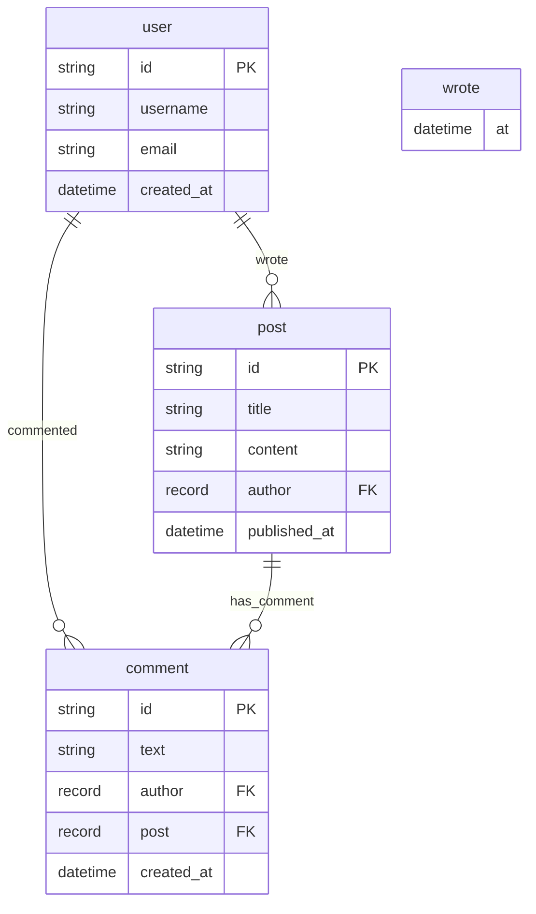

# Blog Schema

<!--
IMPORTANT: VIEWING RENDERED OUTPUT

This Mermaid diagram contains SOURCE CODE with theme directives.
To see the beautiful modern-themed diagram, you need to RENDER it.

HOW TO RENDER:

1. GitHub/GitLab (Easiest):
   - Push this file to GitHub or GitLab
   - View the file - Mermaid renders automatically!

2. Mermaid Live Editor (Online, no installation):
   - Visit: https://mermaid.live/
   - Copy/paste the code from the ```mermaid block below
   - See the rendered diagram instantly!

3. VS Code:
   - Install "Markdown Preview Mermaid Support" extension
   - Open this file
   - Press Ctrl+Shift+V (Cmd+Shift+V on Mac)

4. Documentation Sites:
   - MkDocs: Use mkdocs-mermaid2-plugin
   - Sphinx: Use sphinxcontrib-mermaid
   - Docusaurus/VuePress: Built-in support

For more details: docs/VISUALIZATION_RENDERING_GUIDE.md
-->


